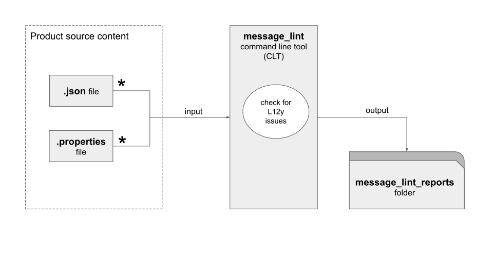

# message_lint

`message_lint` is for software developers or product localization managers who want to 
find out if their product source content contains any localizability (L12y) issues 
before it goes for localization.


This command line tool can read in:
* `react-intl` message resource (JSON) and 
* Java properties files

## A bird eye's view of `message_lint`



## What common L12y issues does `message_lint` look for?

| L12y Issue                                                                                                                           | How to resolve                                                                                         |
|--------------------------------------------------------------------------------------------------------------------------------------|--------------------------------------------------------------------------------------------------------|
| text fragments                                                                                                                       | each message should be a complete sentence/phrase                                                      |
| articles before placeholders                                                                                                         | the value that goes into the placeholder should include the article                                    |
| percentage formatting                                                                                                                | the value that goes into the placeholder should include the percent sign either prefixed or suffixed   |
| embedded URLs/URIs -- this is really not part of the user-facing content. Updating a URL should not trigger a localization workflow. | the URLs/URLs should be external to the messages. They come into the message through the placeholders. |
| inadequate plural nouns                                                                                                              | use the ICU message format to support multiple plural noun forms                                       |
| use of ASCII punctuation                                                                                                             | replace apostrophe with Unicode Right Single Quotation (U+2019)                                        |
|                                                                                                                                      | replace double quotation with Unicode Left and Right Double Quotation (U+201C, U+201D )                |
|                                                                                                                                      | replace ellipses "..." with Unicode Ellipses (U+2026)                                                  |

## How does `message_lint` to find these issues?

It uses regular expression to find these issues.

| `message_lint` checks each message if it...                     | L12y Issues                         |
|-----------------------------------------------------------------|-------------------------------------|
| begins with `,` or `.`                                          | Text Fragments                      |
| begins with one of the following: `and` `or`                    |                                     |
| ends with `,`                                                   |                                     |
| ends with one of the following: `the` `to` `by` `on` `and` `or` |                                     |
|                                                                 |                                     |
| contains `{placeholder}` preceded by                            | Articles before placeholders        |   
| `a` `an` `a(n)` or `the`                                        |                                     |
|                                                                 |                                     |
| contains `{placeholder}%` `{0}%`                                | Percentage Formatting               |
|                                                                 |                                     |
| contains one of the following: `http://` `https://`             | URIs/URLs embedded in messages      | 
| `<a href="...">...</a>`                                         |                                     |
|                                                                 |                                     |
| contains `{placeholder}` followed by:                           | Inadequate support for plural nouns |
| `year` `month` `week` `day`                                     |                                     |
| `hour` `min` `sec`                                              |                                     |
| `groups` `issues` `users` `people` `other` `boards` `spaces`    |                                     |
|                                                                 |                                     |
| contains placeholder that uses a number `{[0-9]+}`              | Non-named placeholders              | 
|                                                                 |                                     |
| contains any of following:                                      | use of ASCII Punctuation Chars      |
| `'` apostrophe (U+0027)                                         |                                     |
| `"` double quote (U+0022)                                       |                                     | 
| `...` 3 periods (U+002E)                                        |                                     |


## Why you should check your source content?

Checking your source content for L12y issues will save time and money if you do it early 
in the product development life cycle (PDLC).

Localization specialists will be grateful too :smile:

## Getting Started

### Install dependencies

Run the following at the command line:

% `cd message_lint`

% `pip install -r requirements.txt`

### First, take a look at the command line help for `message_lint`

*message_lint %* `bin/message_lint --help`

```
usage: message_lint [-h] [-o OUTPUT_FOLDER] [-v] files [files ...]

lint a list of message resource files

positional arguments:
  files                 list of files to be linted

optional arguments:
  -h, --help            show this help message and exit
  -o OUTPUT_FOLDER, --output_folder OUTPUT_FOLDER
                        folder where the report files will be written to.
  -v, --version         show program's version number and exit

Thanks for using message_lint!

%
```

### Now try out the test files we provided

You must pass JSON message files and Java (message) Properties files to `message_lint`.

By default, the lint reports will be generated and located in the same directory 
as the test_files under `message_lint_reports`.

The lint reports will only be generated in `.json` format.

Here are some example command lines you can try out:

#### Example 1.1

When you run the following command line, `message_lint` will examine each message in `test_files\test.json` 
and generate a report of localizability issues if any. By default, the lint reports will be generated and located in 
the same directory as the `test_files` but in `message_lint_reports`

*message_lint %* `bin/message_lint test_files\test.json`

#### Example 1.2

You can also pass it more than one file.

*message_lint %* `bin/message_lint test_files\test.json test_files\test.properties`

A lint report will be generated for each message resource file.

#### Example 2

You can specify a custom output folder where the lint reports will go. 

*message_lint %* `bin/message_lint test.json test.properties --output_folder ..\output`

The lint reports for this next command will located in `output\message_lint_reports`


---
